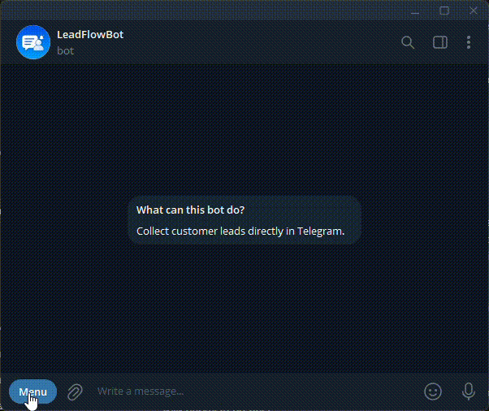

# LeadBot

Telegram bot for collecting customer leads and sending notifications to admin chat.



## Features
- Lead collection flow
- Optional demo mode with "Try demo" and "Order a similar bot" buttons
- Phone validation
- Cancel command
- Admin notifications
- Kotlin + Spring Boot

## Stack
- Kotlin
- Spring Boot
- Telegram Bot API
- JDK 21

## Commands
- /start
- /cancel

## Environment

| Variable | Required | Description |
| --- | --- | --- |
| `TELEGRAM_BOT_TOKEN` | yes | Telegram bot token from BotFather |
| `TELEGRAM_ADMIN_CHAT_ID` | yes | Telegram chat id where lead notifications are sent |
| `TELEGRAM_ORDER_CHAT_ID` | no | Telegram chat id where "Order a similar bot" requests are sent. Falls back to `TELEGRAM_ADMIN_CHAT_ID` |
| `TELEGRAM_BOT_DEMO` | no | Enables demo mode when set to `true` |

The application reads these variables from `app/src/main/resources/application.yml`.

## Local Run

Install JDK 21 before running the project locally. Docker builds already use JDK 21 inside the build image.

PowerShell:

```powershell
$env:TELEGRAM_BOT_TOKEN="your_bot_token"
$env:TELEGRAM_ADMIN_CHAT_ID="your_admin_chat_id"
$env:TELEGRAM_ORDER_CHAT_ID="your_order_chat_id"
$env:TELEGRAM_BOT_DEMO="false"
.\gradlew.bat :app:bootRun
```

Linux/macOS:

```bash
export TELEGRAM_BOT_TOKEN="your_bot_token"
export TELEGRAM_ADMIN_CHAT_ID="your_admin_chat_id"
export TELEGRAM_ORDER_CHAT_ID="your_order_chat_id"
export TELEGRAM_BOT_DEMO="false"
./gradlew :app:bootRun
```

## Docker

Build the image:

```bash
docker build -t leadbot .
```

Run the bot:

```bash
docker run --rm \
  -e TELEGRAM_BOT_TOKEN="your_bot_token" \
  -e TELEGRAM_ADMIN_CHAT_ID="your_admin_chat_id" \
  -e TELEGRAM_ORDER_CHAT_ID="your_order_chat_id" \
  -e TELEGRAM_BOT_DEMO="false" \
  leadbot
```

PowerShell:

```powershell
docker run --rm `
  -e TELEGRAM_BOT_TOKEN="your_bot_token" `
  -e TELEGRAM_ADMIN_CHAT_ID="your_admin_chat_id" `
  -e TELEGRAM_ORDER_CHAT_ID="your_order_chat_id" `
  -e TELEGRAM_BOT_DEMO="false" `
  leadbot
```

The Docker image uses a multi-stage build. Gradle is used only during the build stage, and the final runtime image contains only JRE 21 and the application jar.

## Docker Compose

`.env.example` is a template file.

Do not put real tokens into `.env.example`. Create a separate `.env` file for real deployment values.

Example `.env`:

```env
TELEGRAM_BOT_TOKEN=your_real_bot_token
TELEGRAM_ADMIN_CHAT_ID=your_real_admin_chat_id
TELEGRAM_ORDER_CHAT_ID=your_real_order_chat_id
TELEGRAM_BOT_DEMO=false
```

Run:

```bash
docker compose up -d --build
```

Stop:

```bash
docker compose down
```

## Admin Chat ID

`TELEGRAM_ADMIN_CHAT_ID` is the Telegram id of the person or chat that should receive lead notifications.

If you are the admin but do not have the bot token, open Telegram and write to `@userinfobot` or another trusted Telegram id helper bot. It will show your numeric user id.

Send that id to the developer or set it as `TELEGRAM_ADMIN_CHAT_ID` in your deployment environment.

For group chats, add the bot to the group first. Group chat ids are different from personal user ids.
